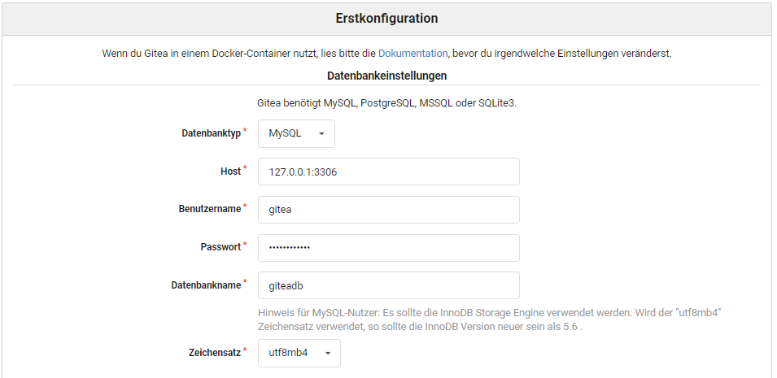
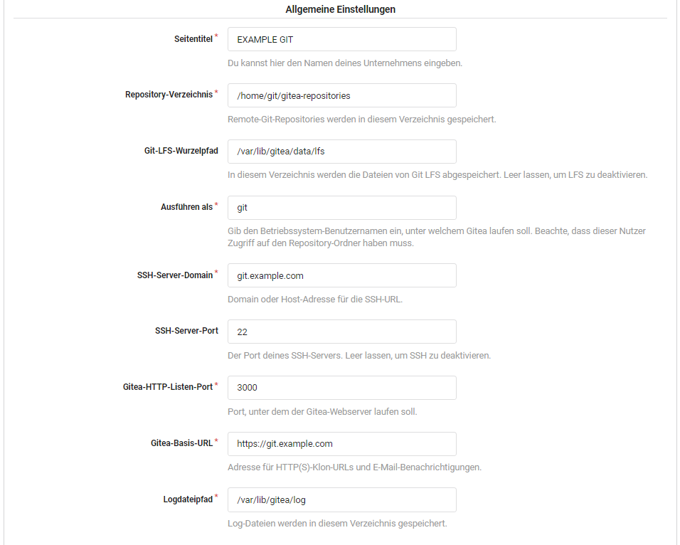
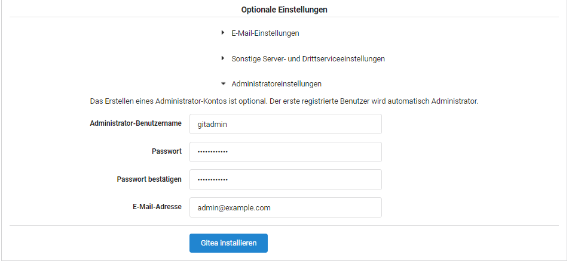

# gitea_installer
Install script for GITEA on Ubuntu 20.04 LTS

This script pulls the newest version of gitea and install all requirements.

The following will be installed:
- GIT
- Nginx
- MariaDB
- Letencrypt (optional)
- UFW (optional)

## Use it ;-)
This installer script is for Ubuntu 20.04 LTS, other versions may work but not tested.

Available flags:
```
-f FQDN - Systemname of GITEA system
-e EMAIL - E-Mail for letsencrypt
-i IP - IPv4 address of this system
-p PASSWORD - Used for GITEA DB
-r SQLROOT - MySQL ROOT password
-l LETSENCRYPT - Use letsencrypt
-u UFW - Use UFW
```

## Install
```
wget https://github.com/lanbugs/gitea_installer/raw/main/gitea_installer.sh
chmod +x gitea_installer.sh

sudo ./gitea_installer.sh -f git.example.com -e admin@example.com -i 10.10.10.10 -p securepassword -r sqlrootpw -l -u
```

Finished screen:
```
--------------------------------------------------------------------------------------
 GITEA 1.12.5 installed on system git.example.com
--------------------------------------------------------------------------------------
 Mysql database        : giteadb
 Mysql user            : gitea
 Mysql password        : securepassword
 Mysql character set   : utf8mb4
--------------------------------------------------------------------------------------
 Mysql root user       : root
 Mysql root password   : sqlrootpw
--------------------------------------------------------------------------------------
 System is accessable via https://git.example.com
--------------------------------------------------------------------------------------
 >>> You must finish the initial setup <<<
--------------------------------------------------------------------------------------
 Site Title            : Enter your organization name.
 Repository Root Path  : Leave the default /home/git/gitea-repositories.
 Git LFS Root Path     : Leave the default /var/lib/gitea/data/lfs.
 Run As Username       : git
 SSH Server Domain     : Use git.example.com
 SSH Port              : 22, change it if SSH is listening on other Port
 Gitea HTTP Listen Port: 3000
 Gitea Base URL        : Use https://git.example.com/
 Log Path              : Leave the default /var/lib/gitea/log
--------------------------------------------------------------------------------------
 Following firewall rules applied:
Status: active

     To                         Action      From
     --                         ------      ----
[ 1] 22/tcp                     ALLOW IN    Anywhere
[ 2] 80/tcp                     ALLOW IN    Anywhere
[ 3] 443/tcp                    ALLOW IN    Anywhere
[ 4] 22/tcp (v6)                ALLOW IN    Anywhere (v6)
[ 5] 80/tcp (v6)                ALLOW IN    Anywhere (v6)
[ 6] 443/tcp (v6)               ALLOW IN    Anywhere (v6)

--------------------------------------------------------------------------------------
```


When the script finished you must complete the installation of gitea in the web UI.

## SQL settings
You should choose utf8mb4 encoding.



## Common settings


## Additional settings

